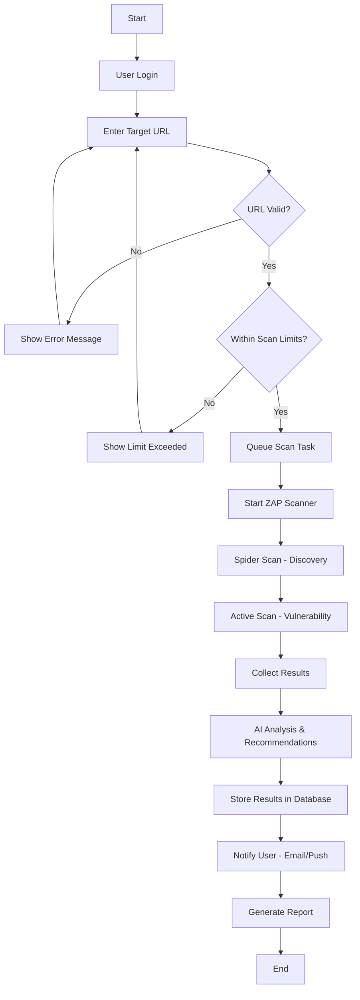

```mermaid
flowchart TD
    A[Start] --> B[User Login]
    B --> C[Enter Target URL]
    C --> D{URL Valid?}
    D -->|No| E[Show Error Message]
    E --> C
    D -->|Yes| F{Within Scan Limits?}
    F -->|No| G[Show Limit Exceeded]
    G --> C
    F -->|Yes| H[Queue Scan Task]
    H --> I[Start ZAP Scanner]
    I --> J[Spider Scan - Discovery]
    J --> K[Active Scan - Vulnerability]
    K --> L[Collect Results]
    L --> M[AI Analysis & Recommendations]
    M --> N[Store Results in Database]
    N --> O[Notify User - Email/Push]
    O --> P[Generate Report]
    P --> Q[End]
```
