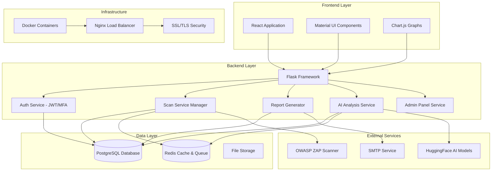

```mermaid
graph TB
    subgraph "Frontend Layer"
        REACT[React Application]
        UI[Material UI Components]
        CHARTS[Chart.js Graphs]
    end
    
    subgraph "Backend Layer"
        FLASK[Flask Framework]
        AUTH[Auth Service - JWT/MFA]
        SCAN[Scan Service Manager]
        REPORT[Report Generator]
        AI_SVC[AI Analysis Service]
        ADMIN[Admin Panel Service]
    end
    
    subgraph "Data Layer"
        POSTGRES[(PostgreSQL Database)]
        REDIS[(Redis Cache & Queue)]
        FILES[File Storage]
    end
    
    subgraph "External Services"
        ZAP[OWASP ZAP Scanner]
        HF[HuggingFace AI Models]
        SMTP[SMTP Service]
    end
    
    subgraph "Infrastructure"
        DOCKER[Docker Containers]
        NGINX[Nginx Load Balancer]
        SSL[SSL/TLS Security]
    end
    
    REACT --> FLASK
    UI --> FLASK
    CHARTS --> FLASK
    
    FLASK --> AUTH
    FLASK --> SCAN
    FLASK --> REPORT
    FLASK --> AI_SVC
    FLASK --> ADMIN
    
    AUTH --> POSTGRES
    SCAN --> POSTGRES
    REPORT --> POSTGRES
    AI_SVC --> POSTGRES
    
    SCAN --> REDIS
    AI_SVC --> REDIS
    
    SCAN --> ZAP
    AI_SVC --> HF
    REPORT --> SMTP
    
    DOCKER --> NGINX
    NGINX --> SSL
```
