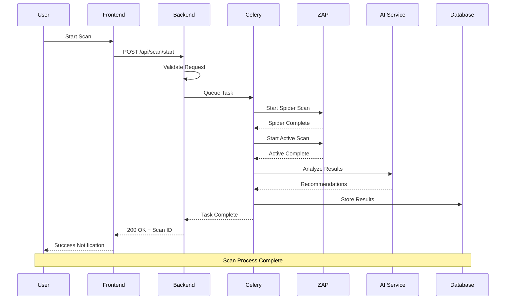

```mermaid
sequenceDiagram
    participant U as User
    participant F as Frontend
    participant B as Backend
    participant C as Celery
    participant Z as ZAP
    participant AI as AI Service
    participant DB as Database
    
    U->>F: Start Scan
    F->>B: POST /api/scan/start
    B->>B: Validate Request
    B->>C: Queue Task
    C->>Z: Start Spider Scan
    Z-->>C: Spider Complete
    C->>Z: Start Active Scan
    Z-->>C: Active Complete
    C->>AI: Analyze Results
    AI-->>C: Recommendations
    C->>DB: Store Results
    C-->>B: Task Complete
    B-->>F: 200 OK + Scan ID
    F-->>U: Success Notification
    
    Note over U,DB: Scan Process Complete
```
