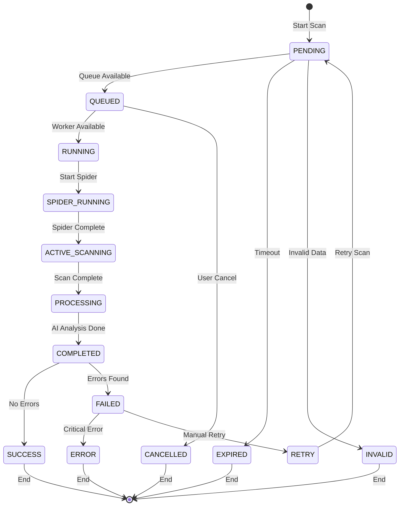

```mermaid
stateDiagram-v2
    [*] --> PENDING: Start Scan
    PENDING --> QUEUED: Queue Available
    PENDING --> EXPIRED: Timeout
    PENDING --> INVALID: Invalid Data
    
    QUEUED --> RUNNING: Worker Available
    QUEUED --> CANCELLED: User Cancel
    
    RUNNING --> SPIDER_RUNNING: Start Spider
    SPIDER_RUNNING --> ACTIVE_SCANNING: Spider Complete
    ACTIVE_SCANNING --> PROCESSING: Scan Complete
    PROCESSING --> COMPLETED: AI Analysis Done
    
    COMPLETED --> SUCCESS: No Errors
    COMPLETED --> FAILED: Errors Found
    
    FAILED --> ERROR: Critical Error
    FAILED --> RETRY: Manual Retry
    
    RETRY --> PENDING: Retry Scan
    ERROR --> [*]: End
    SUCCESS --> [*]: End
    CANCELLED --> [*]: End
    EXPIRED --> [*]: End
    INVALID --> [*]: End
```
