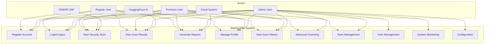

```mermaid
graph TB
    subgraph "WebSecPen System"
        UC1[Register Account]
        UC2[Login/Logout]
        UC3[Start Security Scan]
        UC4[View Scan Results]
        UC5[Generate Reports]
        UC6[Manage Profile]
        UC7[View Scan History]
        UC8[Advanced Scanning]
        UC9[Team Management]
        UC10[User Management]
        UC11[System Monitoring]
        UC12[Configuration]
    end
    
    subgraph "Actors"
        RU[Regular User]
        PU[Premium User]
        AU[Admin User]
        ZAP[OWASP ZAP]
        AI[HuggingFace AI]
        EMAIL[Email System]
    end
    
    RU --> UC1
    RU --> UC2
    RU --> UC3
    RU --> UC4
    RU --> UC5
    RU --> UC6
    RU --> UC7
    
    PU --> UC1
    PU --> UC2
    PU --> UC3
    PU --> UC4
    PU --> UC5
    PU --> UC6
    PU --> UC7
    PU --> UC8
    PU --> UC9
    
    AU --> UC1
    AU --> UC2
    AU --> UC3
    AU --> UC4
    AU --> UC5
    AU --> UC6
    AU --> UC7
    AU --> UC8
    AU --> UC9
    AU --> UC10
    AU --> UC11
    AU --> UC12
    
    ZAP --> UC3
    AI --> UC4
    EMAIL --> UC5
```
